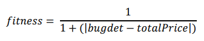
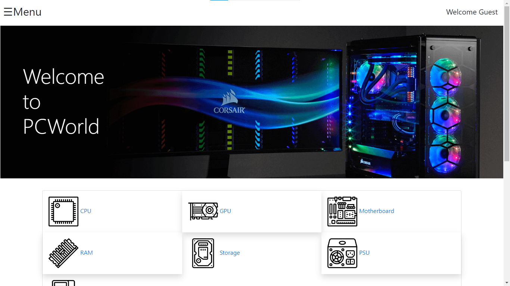
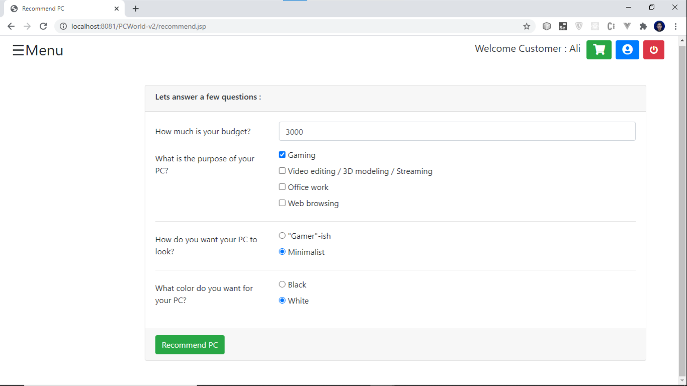
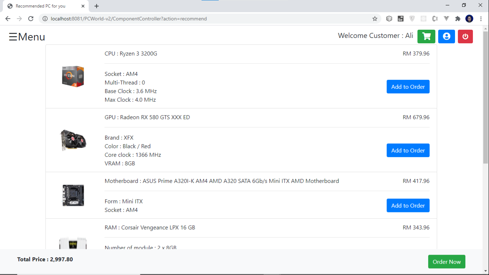
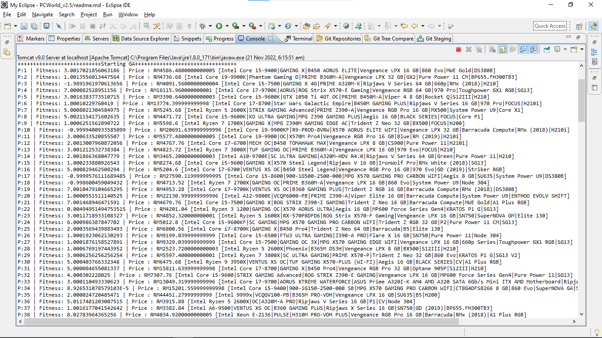
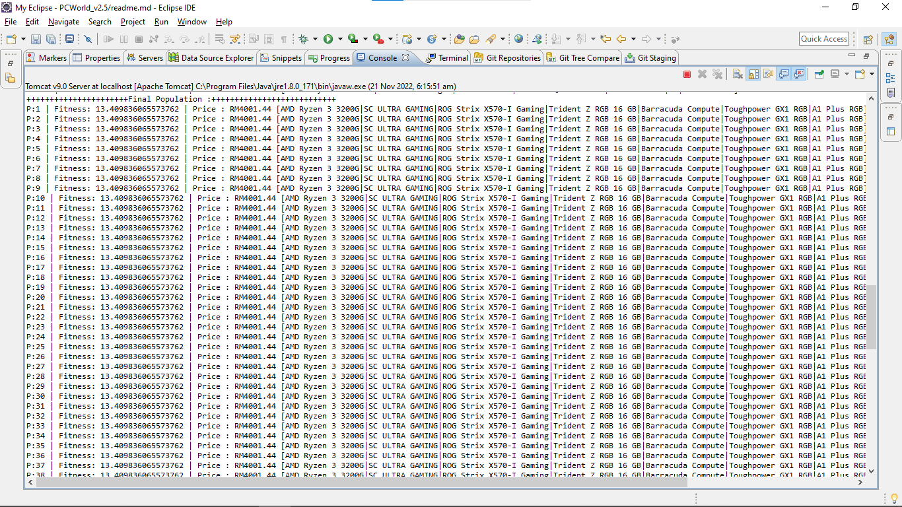
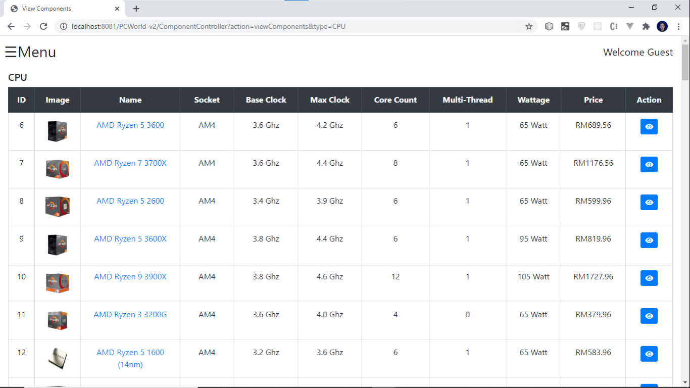
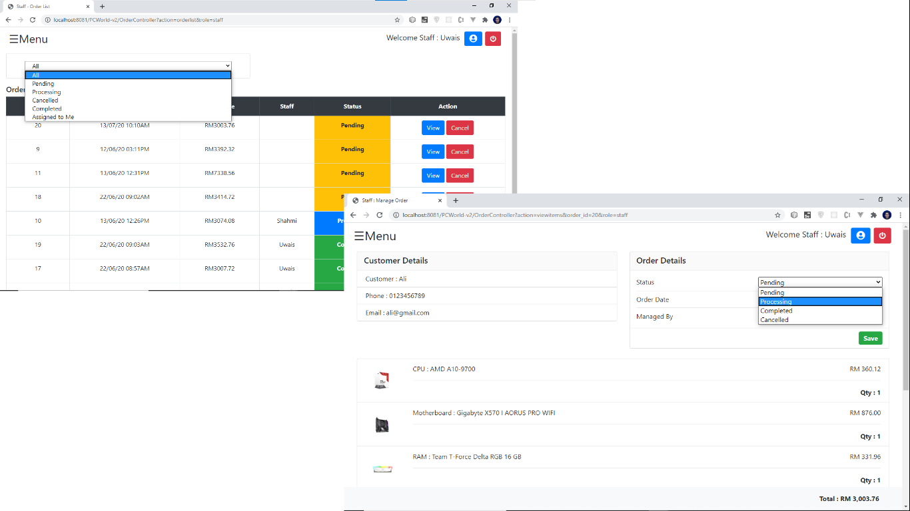
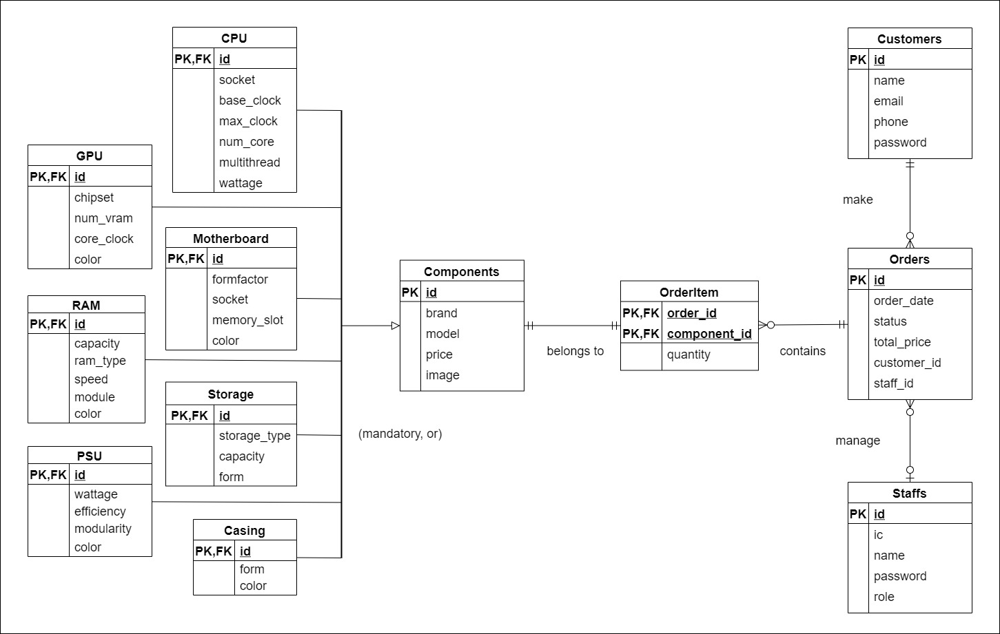

# PC Recommendation System using Genetic Algorithm

This is my university FYP (final year project) that uses GA (Genetic Algorithm) to find the best combination of PC components for PCWorld customer. PCWorld is a computer shop in the town. One the problems that is faced by the staff is to recommend PC components combination since there are hundreds of possible combinations. Hence, this system is developed to help customer to find their desired PC. 

## Genetic Algorithm

Genetic algorithm is a branch of artificial intelligence (AI) that is based on natural selection, the process that drives biological evolution. The genetic algorithm repeatedly modifies a population of individual solutions. At each step, the genetic algorithm selects individuals from the current population to be parents and uses them to produce the children for the next generation. Over successive generations, the population "evolves" toward an optimal solution. The individuals are selected based on their fitness (a.k.a survival of the fittest).

Fitness function is used to determine the individual's fitness score. Image below shows the fitness function used in this GA. Inverse function was used to give higher fitness score when the price difference is smaller. An absolute value was used after subtracting the price difference in order to prevent negative values. Lastly, an arbitrary number which is one (1) was added to the price difference to prevent dividing by zero (0).  

## Features

- PC recommendation based on budget, usage style and color.
- The system able to check for the PC components' compatibility between each other.
- Able to get recommendation in only a few seconds.
- Add to cart and order function.
- Python scripts were used to scrape data from [PCPartPicker](https://pcpartpicker.com/) website to seed the database with PC components.  
	- Data cleaning is done by ignoring components with invalid name or price.  
	- Price is converted from USD to MYR (Ringgit Malaysia) before inserted into the database.

## Screenshots

Home page

Choose PC preferences

Recommendation result page

1st generation

1000th generation

View CPU page

View customer's order

## ERD

The ERD will be the baseline when designing the database. It consisted of 5 primary tables. It also has seven
tables that has inheritance relationship with the Components table, which is table CPU, GPU, Motherboard, RAM, Storage, PSU and Casing.

## Tech stack

- Backend: Java
- Frontend: Java Server Pages (JSP), Bootstrap 4
- Database: MySQL
- Python for web scraping
